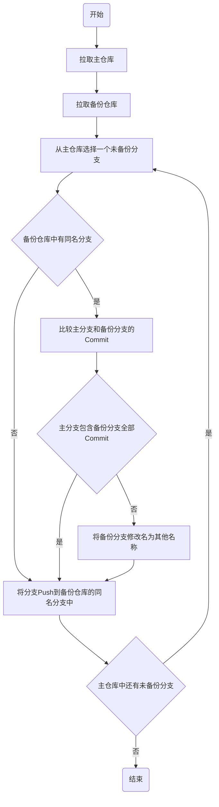

# backup
A series of scripts to backup my code to other sites.

## 使用方法

### 压缩文件式备份

```sh
GH_TOKEN=<你在GitHub上的Personal Access Token>
BKUP_TOKEN=<你在备份仓库中的Personal Access Token>
./run_backup_to_tar.gz.sh <GitHub用户名> $GH_TOKEN https://$BKUP_TOKEN@<网址>/<备份仓库用户名>/<仓库> <分支>
```

将GitHub上在`<GitHub用户名>`用户下的所有仓库备份后打包成压缩文件，然后用git传到`https://$BKUP_TOKEN@<网址>/<备份仓库用户名>/<仓库>`仓库的`<分支>`下。

比如，将GitHub上的`yindaheng98`的所有仓库备份后打包成压缩文件备份到一个自建仓库`fuck_backup.yindaheng98.top/fuck98/backup`下的`backup_repo_pack`分支中：

```sh
GH_TOKEN=XXXXXXXXXXXXXXX
BKUP_TOKEN=XXXXXXXXXXXXXXX
./run_backup_to_tar.gz.sh yindaheng98 $GH_TOKEN https://$BKUP_TOKEN@fuck_backup.yindaheng98.top/fuck98/backup backup_repo_pack
```

### 仓库式备份

仓库式备份目前支持`Gitee`和`Gitlab`。

```sh
GH_TOKEN=<你在GitHub上的Personal Access Token>
GL_TOKEN=<你在Gitlab上的Personal Access Token>
GE_TOKEN=<你在Gitee上的Personal Access Token>
BACKUP_REPO_LIST=$(./get_backup_repo_list.sh <GitHub用户名> $GH_TOKEN "[\"get_remote_repo/gitee.sh <Gitee用户名> $GE_TOKEN\",\"get_remote_repo/gitlab.sh <Gitlab用户名> $GL_TOKEN\"]")
./backup_all_to_remote.sh <GitHub用户名> $GH_TOKEN $BACKUP_REPO_LIST
```

将GitHub上在`<GitHub用户名>`用户下的所有仓库备份到Gitlab和Gitee中对应`<Gitlab用户名>`和`<Gitee用户名>`下的同名仓库中，且其可见性与Github上的仓库可见性相同。

比如，将GitHub上的`yindaheng98`的所有仓库备份到Gitlab和Gitee的`yindaheng98`下的仓库中：

```sh
GH_TOKEN=XXXXXXXXXXXXXXX
GL_TOKEN=XXXXXXXXXXXXXXX
GE_TOKEN=XXXXXXXXXXXXXXX
BACKUP_REPO_LIST=$(./get_backup_repo_list.sh yindaheng98 $GH_TOKEN "[\"get_remote_repo/gitee.sh yindaheng98 $GE_TOKEN\",\"get_remote_repo/gitlab.sh yindaheng98 $GL_TOKEN\"]")
./backup_all_to_remote.sh yindaheng98 $GH_TOKEN $BACKUP_REPO_LIST
```

## 原理

### 定义

* 主仓库：要备份的仓库
* 备份仓库：备份到的仓库
* 主分支：主仓库中的某个待备份的分支
* 备份分支：在备份仓库中与主分支同名的分支
* 备份汇总仓库：所有的备份仓库最后都会打成压缩包汇总到这个仓库中

### 仓库备份流程

注意，本项目中执行的所谓“备份”不是简单地将仓库下载再原封不动地上传到备份仓库中，而是遵循如下备份流程：



### `get_backup_repo_list.sh`和`backup_all_to_remote.sh`

在前面讲到的使用方法中，可以看到一条合用`get_backup_repo_list.sh`和`backup_all_to_remote.sh`的指令，功能解释如下：

```sh
BACKUP_REPO_LIST=$(./get_backup_repo_list.sh <GitHub用户名> $GH_TOKEN "[\"get_remote_repo/gitee.sh <Gitee用户名> $GE_TOKEN\",\"get_remote_repo/gitlab.sh <Gitlab用户名> $GL_TOKEN\"]")
```

这个命令包含如下功能：

1. 自动抓取`<GitHub用户名>`下所有仓库及可见性
2. 对每个仓库都调用后面那个JSON数组中写出的两个指令，这两个指令分别调用Gitlab和Gitee的API执行操作：
   1. 在Gitlab/Gitee上创建具有同样可见性的同名备份仓库
   2. 修改已有备份仓库的可见性以使之与Github上的仓库可见性相同
   3. 返回clone备份仓库的地址（包含token的那种地址）
3. 将所有备份仓库的clone地址聚合为一个JSON Object
4. 返回聚合而成的JSON Object

```sh
./backup_all_to_remote.sh <GitHub用户名> $GH_TOKEN $BACKUP_REPO_LIST
```

这个命令包含如下功能：

1. 读取上一步聚合而成的JSON Object
2. 自动抓取`<GitHub用户名>`下所有仓库
3. 对每个仓库都从JSON Object中找到对应的备份仓库地址
   * 每个仓库的备份仓库地址都包含一个Gitlab上的地址和一个Gitee上的地址
4. 执行备份操作并推送备份仓库

### `run_src.sh`

用`$1`地址所指仓库的`$2`分支覆盖`$3`地址所指仓库的`$4`分支。

## 坑

```sh
PARAMS=$2 # GET链接的参数，JSON格式

param=''
#直接用管道符写while循环会开启新进程，使while里面的变量不能传到外部
while read K; do
    V=$(echo $PARAMS | jq -cr ".$K")
    if [ $K ]; then
        param=$param"$K=$V&"
    fi
done <<<$(echo $PARAMS | jq -cr 'keys | .[]')
```

这样的代码在Ubuntu 16.04上读出来第一个`$K`是`PARAMS`中所有的key组成的字符串，在Ubuntu 20.04上才是每个`$K`一个key。原因不知道。