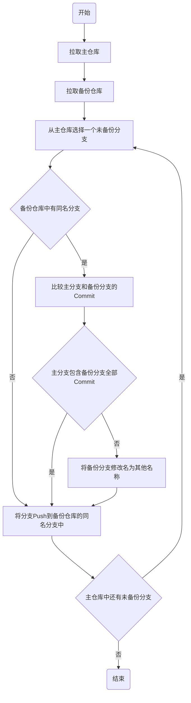

# backup
A series of scripts to backup my code to other sites.

## 原理

### 定义

* 主仓库：要备份的仓库
* 备份仓库：备份到的仓库
* 主分支：主仓库中的某个待备份的分支
* 备份分支：在备份仓库中与主分支同名的分支
* 备份汇总仓库：所有的备份仓库最后都会打成压缩包汇总到这个仓库中

### 仓库备份流程

备份仓库构造完成之后，还会有集中打压缩包和push到备份汇总仓库的操作，流程图略。

## 实现

### `run_pack.sh`和`run_dir.sh`：主程序

主程序`run_pack.sh`和`run_dir.sh`的输入格式相同：`$1`是要备份的github用户名、`$2`是备份汇总仓库的地址、`$2`备份压缩文件在仓库中存储的分支地址。

`run_pack.sh`在备份后会将每个仓库打成压缩包上传，而`run_dir.sh`直接将`.git`文件夹上传。

### `getrepo.sh`：拉取仓库

该文件负责拉取仓库。脚本参数为一个仓库URL和一个文件夹路径：`$1`是仓库URL、`$2`是文件夹路径，用于指示将仓库的`.git`目录放到哪个文件夹下。

注意，`getrepo.sh`只拉取`.git`目录，不拉取其他文件。

### `backup.sh`：构造备份仓库

构造备份仓库的主要逻辑都在`backup.sh`文件中，该文件负责按照上文中的流程图操作备份仓库。脚本参数为两个文件夹路径：`$1`是主仓库的文件夹路径、`$2`是备份仓库的文件夹路径。

### `run_src.sh`

用`$1`地址所指仓库的`$2`分支覆盖`$3`地址所指仓库的`$4`分支。
