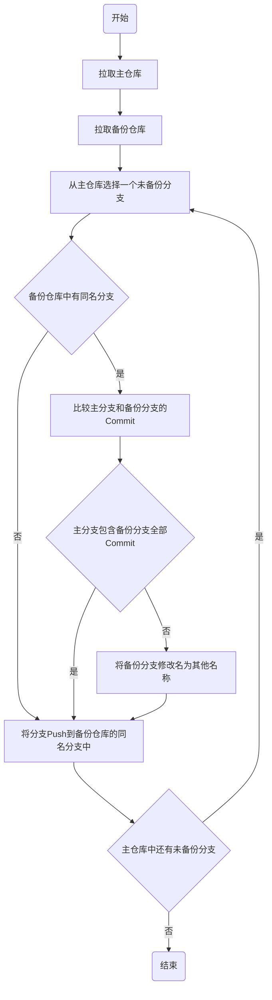

# backup

A series of scripts to backup my code to other sites.

一键将你的代码备份到其他平台，或打成压缩包上传到云存储中。

## 背景

### 场景描述

* 🤡用CI的Cron功能挂了一个脚本每天备份一次仓库：
  * 这个备份脚本很简单，就是下载仓库，覆盖已有的备份仓库
* 🤡是个脑残，记不住密码，于是在很多平台上都用的同一个密码
* 某日，某🤡误将带密码的文件commit到了GitHub上
* 一个多月后，🤡发现自己误传的密码文件
* 这一个多月间经过了无数的commit，密码文件的位置也变动了很多次
* 趁着泄密灾难还没发生，🤡想要删除这个密码文件在commit里面的所有历史记录
* 然而，🤡曾经在这个Repo里面写了一个愚蠢的核心程序：
  * 这个核心程序要调用git读取commit里面的文件修改记录才能正常运行
  * 删除任何一个commit都会导致程序输出错误的结果
* 因此🤡只能对每一个commit进行修改：
  * 在每一个commit中删除这个密码文件
  * 不能影响任何其他文件在commit中的修改记录
  * 更不能删除任何commit
* 🤡稍加思索，Google到了修改commit的方法
* 🤡一通操作猛如虎，写了个脚本把commit全改了
* 🤡解决了问题，被快乐的喜悦冲昏了头脑，跳过了检查的步骤直接打了一句`git push -f`
* 🤡睡了
* 第二天，🤡上Github一看
* 🤡愚蠢的脚本把commit改的面目全非了
* 🤡方了，想去备份里面恢复昨天的仓库
* 🤡发现仓库被覆盖了，里面已经是被改的面目全非了的仓库
* 🤡只能手动恢复无数的commit了
* 🤡凉了


### 问题分析（教训）

* 🤡的仓库备份方法：将Github上的仓库下载下来覆盖本地的备份仓库
* 能避免🤡手贱毁档的仓库备份方法：不仅要备份文件的历史记录(commit)，branch的记录也要备份
  * 下载Github上的仓库
  * 比对它与本地备份仓库的每个branch
    * 如果同名的branch中commit完全一样，不做操作
    * 如果Github上的branch是本地同名的branch的fast forward，可以直接覆盖
    * 不是fast forward？那说明branch内部有commit修改，则需要先把本地branch备份一下，才能进行覆盖

归根结底，就是要能识别branch中的commit历史记录被修改了，要保存修改前的branch。

没能找到这种精细到备份每个分支的备份方法，遂自己做了一个。

## 使用方法

### 压缩文件式备份

```sh
PLUGIN_PATH=<网络文件系统插件路径>
GH_TOKEN=<你在GitHub上的Personal Access Token>
./run_backup_to_tar.gz.sh $GH_TOKEN $PLUGIN_PATH
```

将GitHub上在`GH_TOKEN`对应用户下的所有仓库备份后打包成压缩文件，然后用网络文件系统插件进行上传。

网络文件系统插件是什么？见[plugins/remote_filesystem](plugins/remote_filesystem)中的解释。本项目自带一个Aliyun OSS的插件。

如果用本项目提供的Aliyun OSS插件上传：

```sh
accessKeyID=<你的Aliyun账户的 AccessKey ID>
accessKeySecret=<你的Aliyun账户 AccessKey Secret>
endpoint=<备份汇总仓库Bucket所在地域的Endpoint>
backupPath=<备份汇总仓库文件夹路径，比如 oss://github-backups/backup1>
PLUGIN_PATH=$(pwd)'/plugins/remote_filesystem/aliyun_oss'
GH_TOKEN=<你在GitHub上的Personal Access Token>
$PLUGIN_PATH/configure.sh $accessKeyID $accessKeySecret $endpoint $backupPath
./run_backup_to_tar.gz.sh $GH_TOKEN $PLUGIN_PATH
```

### 仓库式备份

仓库式备份目前支持`Gitee`和`Gitlab`。

```sh
GH_TOKEN=<你在GitHub上的Personal Access Token>
GL_TOKEN=<你在Gitlab上的Personal Access Token>
GE_TOKEN=<你在Gitee上的Personal Access Token>
REPO_PLUGINS="[\"plugins/make_repo_available/gitee.sh <Gitee用户名> $GE_TOKEN\",\"plugins/make_repo_available/gitlab.sh <Gitlab用户名> $GL_TOKEN\"]"
BACKUP_REPO_LIST=$(./get_backup_repo_list.sh <GitHub用户名> $GH_TOKEN "$REPO_PLUGINS")
./backup_all_to_remote.sh <GitHub用户名> $GH_TOKEN $BACKUP_REPO_LIST
```

将GitHub上在`<GitHub用户名>`用户下的所有仓库备份到Gitlab和Gitee中对应`<Gitlab用户名>`和`<Gitee用户名>`下的同名仓库中，且其可见性与Github上的仓库可见性相同。

比如，将GitHub上的`yindaheng98`的所有仓库备份到Gitlab和Gitee的`yindaheng98`下的仓库中：

```sh
GH_TOKEN=XXXXXXXXXXXXXXX
GL_TOKEN=XXXXXXXXXXXXXXX
GE_TOKEN=XXXXXXXXXXXXXXX
REPO_PLUGINS="[\"plugins/make_repo_available/gitee.sh yindaheng98 $GE_TOKEN\",\"plugins/make_repo_available/gitlab.sh yindaheng98 $GL_TOKEN\"]"
BACKUP_REPO_LIST=$(./get_backup_repo_list.sh yindaheng98 $GH_TOKEN "$REPO_PLUGINS")
./backup_all_to_remote.sh yindaheng98 $GH_TOKEN $BACKUP_REPO_LIST
```

## 原理

### 定义

* 主仓库：要备份的仓库
* 备份仓库：备份到的仓库
* 主分支：主仓库中的某个待备份的分支
* 备份分支：在备份仓库中与主分支同名的分支
* 备份汇总仓库：所有的备份仓库最后都会打成压缩包汇总到这个仓库中

### 仓库备份流程

注意，本项目中执行的所谓“备份”不是简单地将仓库下载再原封不动地上传到备份仓库中，而是遵循如下备份流程：



### `get_backup_repo_list.sh`和`backup_all_to_remote.sh`

在前面讲到的使用方法中，可以看到一条合用`get_backup_repo_list.sh`和`backup_all_to_remote.sh`的指令，功能解释如下：

```sh
REPO_PLUGINS="[\"plugins/make_repo_available/gitee.sh <Gitee用户名> $GE_TOKEN\",\"plugins/make_repo_available/gitlab.sh <Gitlab用户名> $GL_TOKEN\"]"
BACKUP_REPO_LIST=$(./get_backup_repo_list.sh <GitHub用户名> $GH_TOKEN "$REPO_PLUGINS")
```

这个命令包含如下功能：

1. 自动抓取`<GitHub用户名>`下所有仓库及可见性
2. 对每个仓库都调用后面那个JSON数组中写出的两个指令，这两个指令分别调用Gitlab和Gitee的API执行操作：
   1. 在Gitlab/Gitee上创建具有同样可见性的同名备份仓库
   2. 修改已有备份仓库的可见性以使之与Github上的仓库可见性相同
   3. 返回clone备份仓库的地址（包含token的那种地址）
3. 将所有备份仓库的clone地址聚合为一个JSON Object
4. 返回聚合而成的JSON Object

```sh
./backup_all_to_remote.sh <GitHub用户名> $GH_TOKEN $BACKUP_REPO_LIST
```

这个命令包含如下功能：

1. 读取上一步聚合而成的JSON Object
2. 自动抓取`<GitHub用户名>`下所有仓库
3. 对每个仓库都从JSON Object中找到对应的备份仓库地址
   * 每个仓库的备份仓库地址都包含一个Gitlab上的地址和一个Gitee上的地址
4. 执行备份操作并推送备份仓库

## 坑

```sh
PARAMS='{"affiliation":"owner","per_page":"100","sort":"updated","visibility":"private"}' # GET链接的参数，JSON格式

param=''
#直接用管道符写while循环会开启新进程，使while里面的变量不能传到外部
while read K; do
    V=$(echo $PARAMS | jq -cr ".$K")
    if [ $K ]; then
        param=$param"$K=$V&"
    fi
done <<<$(echo $PARAMS | jq -cr 'keys | .[]')
echo $param
```

这样的代码在Ubuntu 16.04上读出来第一个`$K`是`PARAMS`中所有的key组成的字符串，在Ubuntu 20.04上才是每个`$K`一个key。原因不知道。

最好用`for`循环：

```sh
PARAMS='{"affiliation":"owner","per_page":"100","sort":"updated","visibility":"private"}'
param=''
for K in $(echo $PARAMS | jq -cr 'keys | .[]'); do
    V=$(echo $PARAMS | jq -cr ".$K")
    if [ $K ]; then
        param=$param"$K=$V&"
    fi
done
echo $param
```