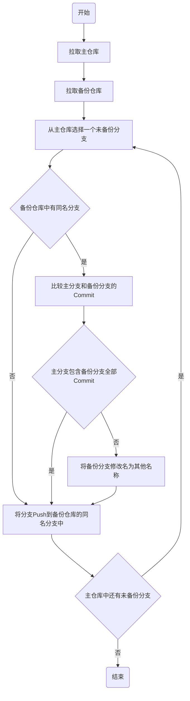

# backup
A series of scripts to backup my code to other sites.

## 原理

### 定义

* 主仓库：要备份的仓库
* 备份仓库：备份到的仓库
* 主分支：主仓库中的某个待备份的分支
* 备份分支：在备份仓库中与主分支同名的分支

### 仓库备份流程

```mermaid
graph TD
开始(开始)-->A1
A1[拉取主仓库]-->A2[拉取备份仓库]-->B1[从主仓库选择一个未备份分支]-->B2{备份仓库中有同名分支}
B2-->|否|C[将分支Push到备份仓库的同名分支中]
B2-->|是|D1[比较主分支和备份分支的Commit]
D1-->D2{主分支包含备份分支全部Commit}
D2-->|是|C
D2-->|否|E1[将备份分支修改名为其他名称]-->C
C-->F{主仓库中还有未备份分支}
F-->|是|B1
F-->|否|结束(结束)
```

## 实现